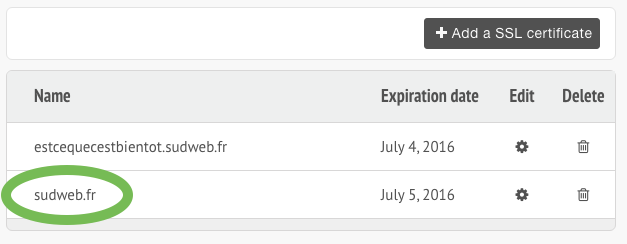

# letsencrypt-alwaysdata

> Update your SSL certs on alwaysdata shared hosting via their REST API.

# Install

The initial setup pulls the source code of this repository as well as its two dependencies:

- [`simp_le`](https://github.com/kuba/simp_le) (to call letsencrypt API);
- [`jq`](https://stedolan.github.io/jq/) (to parse and builds REST payloads).

```bash
cd /home/$USER

git clone https://github.com/oncletom/letsencrypt-alwaysdata.git

cd /home/$USER/letsencrypt-alwaysdata

# installing jq
wget -qO vendor/jq https://github.com/stedolan/jq/releases/download/jq-1.5/jq-linux64
chmod +x vendor/jq

# installing simp_le
python2.7 -m pip install --user git+https://github.com/kuba/simp_le

# extending `.profile`
echo "export PATH=\"/home/\${USER}/letsencrypt-alwaysdata/bin:\${PATH}\"" >> /home/$USER/.profile
```

# Configure

## Alwaysdata API Key

`ALWAYSDATA_API_AUTH` environment variable must be set prior to running the script (and can be found under the [Profile section](https://admin.alwaysdata.com/admin/details/)). This way we avoid leaking the API key in your `history` logs.

```bash
echo "export ALWAYSDATA_API_AUTH=\"<YOUR-API-KEY> account=<YOUR-ACCOUNT>:\"" >> /home/$USER/.profile

# e.g for oncletom.alwaysdata.net:
echo "export ALWAYSDATA_API_AUTH=\"db7db0047d09458a4b422e0156eb46cb account=oncletom:\"" >> /home/$USER/.profile
```

## HTTP redirects

You will have to exempt the `.well-known/acme-challenge` folder from any redirections
if you want the `letsencrypt` client to be able to verify the authenticity of your request.

It can be the case if you have configured Apache to *redirect various domains* and *insecure traffic*
to a secured one, for example.

```apache
<IfModule mod_rewrite.c>

  # vvvvvvvvvvvvvvvvvv
  RewriteCond %{REQUEST_URI} ^/.well-known/acme-challenge [NC]
  RewriteRule .* - [L]
  # ^^^^^^^^^^^^^^^^^^

  # redirects all vhosts pointing to the same directory to a single domain
  RewriteCond %{HTTP_HOST} !^YOUR-DOMAIN.TLD [NC]
  RewriteRule ^ https://YOUR-DOMAIN.TLD%{REQUEST_URI} [L,R=301,NE]

  # redirects all non-https requests to a single domain
  RewriteCond %{HTTP:X-Forwarded-Proto} !https
  RewriteRule ^ https://YOUR-DOMAIN.TLD%{REQUEST_URI} [R=301,L,NE]
</IfModule>
```

# Update

You may want to update this software if it had received some changes or fixed some bugs:

```bash
cd /home/$USER/letsencrypt-alwaysdata && git reset --hard && git pull
```

## Cronjob

TBD.

# Use

```bash
source /home/$USER/.profile

update-certificate \
  --cert-name example.com \
  --site-dir /home/$USER/www \
  --letsencrypt-options "-d example.com -d www.example.com"
```

## `--cert-name`

This is the name of the certificate as found [in the Alwaysdata admin interface](https://admin.alwaysdata.com/ssl/).

Example: `--cert-name sudweb.fr`.



## `--site-dir`

This is the location of the website served by the certificate.

Example: `--site-dir /home/$USER/www`.

## `--letsencrypt-options`

Any other option you would like to pass to letsencrypt, like your domains and eventually their individual mapping.

Example: `--letsencrypt-options "-d sudweb.fr -d www.sudweb.fr -d estcequecestientot.sudweb.fr:/home/$USER/estcequecestbientot"`.

# License

> The MIT License (MIT)
> Copyright (c) 2016 Thomas Parisot
>
> Permission is hereby granted, free of charge, to any person obtaining a copy of this software and associated documentation files (the "Software"), to deal in the Software without restriction, including without limitation the rights to use, copy, modify, merge, publish, distribute, sublicense, and/or sell copies of the Software, and to permit persons to whom the Software is furnished to do so, subject to the following conditions:
>
> The above copyright notice and this permission notice shall be included in all copies or substantial portions of the Software.
>
> THE SOFTWARE IS PROVIDED "AS IS", WITHOUT WARRANTY OF ANY KIND, EXPRESS OR IMPLIED, INCLUDING BUT NOT LIMITED TO THE WARRANTIES OF MERCHANTABILITY, FITNESS FOR A PARTICULAR PURPOSE AND NONINFRINGEMENT. IN NO EVENT SHALL THE AUTHORS OR COPYRIGHT HOLDERS BE LIABLE FOR ANY CLAIM, DAMAGES OR OTHER LIABILITY, WHETHER IN AN ACTION OF CONTRACT, TORT OR OTHERWISE, ARISING FROM, OUT OF OR IN CONNECTION WITH THE SOFTWARE OR THE USE OR OTHER DEALINGS IN THE SOFTWARE.
